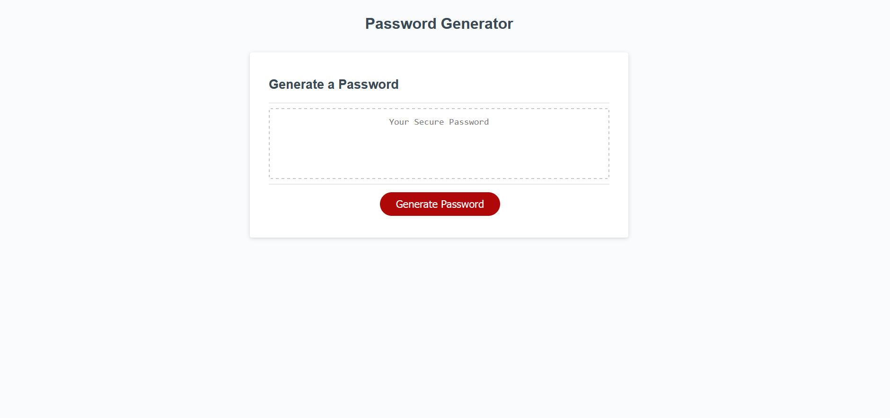
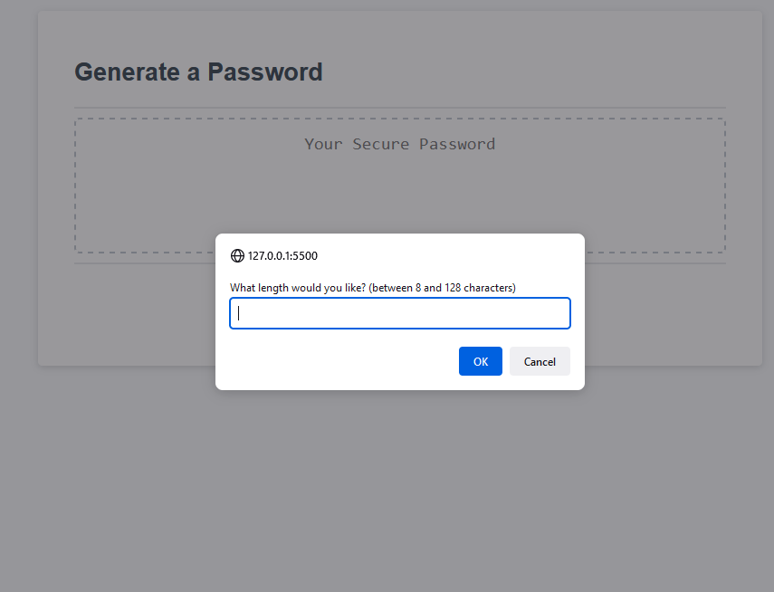
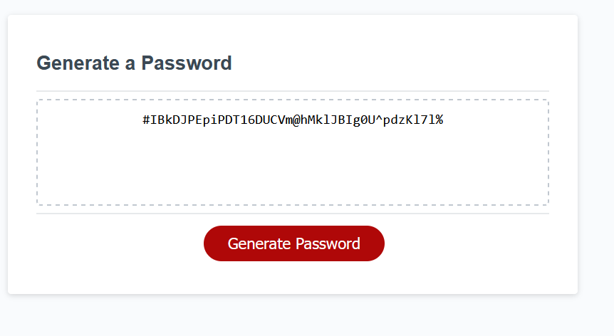

# Secure Password Generator

This week required modification a starter code to create an application that enables employees to generate random passwords based on criteria that they’ve selected. 

I was given HTML and CSS to begin with however had to create the JavaScript. 
The code I have created, runs along side of the CSS and HTML, it functions smoothly has the ability to adapt to multiple screens.

When you click the generate button you are presented with a series of prompts for password criteria.
You can then select which criteria to include in the password (length, uppercase, lowercase, numeric or special).
Then a password is generated that matches the selected criteria.
If the criterias are not correctly selected you will be prompted to retry.

## Screenshots

## Link to Deployed Application

https://shs-peb.github.io/Secure-Password-Generator/